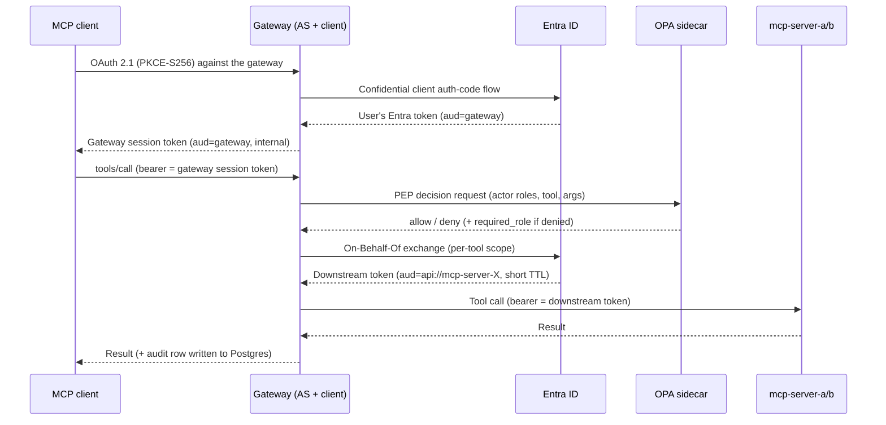

# Enterprise MCP Gateway — Reference Implementation

> ## ⚠️ What this is, and what it is not
>
> This repository is a **teaching artifact**: a worked example, published to show
> what an MCP gateway has to do and why, for people who are about to build or buy
> one. It is **not production-ready software**, and it is not a product.
>
> It is real code — it runs against a real Entra tenant, the tests pass, and every
> claim below is something you can go and read. But it makes deliberate
> simplifications that a production deployment must not: per-process state, a
> hand-maintained tool registry, best-effort audit writes, no policy shadow mode.
> Those are listed in *Known limitations* and *What this does not solve*, and they
> are as much the point as the code is.
>
> **Use it to learn the shape of the control point, and to steal the ideas.** Use
> the three-part write-up as the checklist you hold your own design — or a
> vendor's — against:
> [1 · Why you need an MCP gateway](https://juergen-neulinger.dev/posts/mcp-gateway-01-why-you-need-one/) ·
> [2 · Three layers of policy](https://juergen-neulinger.dev/posts/mcp-gateway-02-three-layers-of-policy/) ·
> [3 · What it takes to run one](https://juergen-neulinger.dev/posts/mcp-gateway-03-what-it-takes-to-run-one/).
> Do not put this in front of your CRM on Monday.

A public, MIT-licensed reference implementation of the [MCP authorization spec (2025-11-25)](https://modelcontextprotocol.io/specification/2025-11-25/basic/authorization) for enterprise deployments.

An MCP gateway that sits between unmodified MCP clients (Claude Code, VS Code, Cursor) and backend MCP servers:

- speaks **OAuth 2.1** to clients (RFC 9728 + RFC 8414 metadata, PKCE-S256, pre-registration / CIMD / DCR-shim);
- is a **confidential OAuth client to Microsoft Entra ID** behind the scenes;
- enforces authorization with an **OPA** sidecar and a three-layer Rego bundle, including content-based (argument-level) policy and **per-tool entitlements via Entra app roles** (see the limitation note under "Known limitations");
- never passes the client's token through — every backend hop uses a fresh, audience-scoped, short-TTL token minted by an **On-Behalf-Of** or client-credentials exchange;
- writes a structured **audit log** shaped for NIS2 / DORA / EU AI Act / GDPR reporting.

> Status: implemented and tested — the OAuth AS surface, Entra broker (AzureProvider), OBO/M2M downstream exchange, OPA PEP, and audit logging all work. Hardening (Redis-backed state, tamper-evident audit) is deliberately out of scope here; see *Known limitations*.

## How to read this repo

This is a **blueprint, meant to be read, not just deployed** — a worked example of
building an MCP gateway that speaks OAuth 2.1 to clients, brokers Entra ID behind the
scenes, and enforces authorization with a policy engine, for anyone implementing
their own. Running it (below) shows *that* it works; reading it shows *how* and
*why*. Suggested order, following a single tool call through the system:

1. [`policy/data.json`](policy/data.json) — the static data a decision is made against (which roles gate which servers/tools).
2. [`policy/bundle/mcp/`](policy/bundle/mcp/) — the three Rego layers (`platform.rego` → `domain.rego` → `tool.rego`) that consult it.
3. [`gateway-fastmcp/app/middleware/opa_pep.py`](gateway-fastmcp/app/middleware/opa_pep.py) — the Policy Enforcement Point that calls OPA and acts on the decision.
4. [`gateway-fastmcp/app/tools/registry.py`](gateway-fastmcp/app/tools/registry.py) — the per-tool metadata (elevated role, downstream scope, regulatory tags) the PEP reads.
5. [`gateway-fastmcp/app/downstream/obo.py`](gateway-fastmcp/app/downstream/obo.py) and [`m2m.py`](gateway-fastmcp/app/downstream/m2m.py) — how the gateway gets a fresh, backend-scoped token for the hop downstream.
6. [`gateway-fastmcp/app/auth.py`](gateway-fastmcp/app/auth.py) — the inbound OAuth 2.1 AS surface clients authenticate against.

Then read **"Known limitations"** and **"What this does not solve"** below — for a
teaching reference, the edges of its scope are as much the point as the code itself.

## Architecture

The gateway is simultaneously an OAuth 2.1 authorization server (to clients) and a confidential OAuth client (to Entra) — that dual role is what lets unmodified clients work against an IdP that doesn't support DCR. Three tokens are in flight and never confused: the user's Entra token (`aud`=gateway), the gateway's session token to clients (`aud`=gateway, internal), and the per-backend OBO token (`aud`=`api://mcp-server-X`, short TTL).

One naming note, since it is conflated nearly everywhere: Entra's **On-Behalf-Of** is a JWT-bearer *assertion* grant (RFC 7523 §2.1) plus Microsoft's `requested_token_use=on_behalf_of` — **not** RFC 8693 token exchange, which is a different grant type the v2.0 token endpoint does not accept. See [`app/downstream/obo.py`](gateway-fastmcp/app/downstream/obo.py).

```
MCP client ──OAuth 2.1──▶ Gateway ──OBO──▶ Entra ID
                            │
                            ├── OPA sidecar (3-layer Rego)
                            ├── Postgres (audit log)
                            └──▶ mcp-server-a (CRM)  /  mcp-server-b (ledger)
```

The sequence below is the same picture, expanded to the three-token detail from the
paragraph above:



## Repo layout

| Path                                       | What                                                                                                                   |
| ------------------------------------------ | ---------------------------------------------------------------------------------------------------------------------- |
| `gateway-fastmcp/`                       | FastMCP gateway — OAuth AS surface (AzureProvider), Entra broker, OBO/M2M exchange, OPA + audit middleware, MCP proxy |
| `mcp-server-a/`                          | FastMCP server — fake CRM tools, validates`aud=api://mcp-server-a`                                                  |
| `mcp-server-b/`                          | FastMCP server — fake ledger tools, validates`aud=api://mcp-server-b`                                               |
| `policy/bundle/mcp/`                     | Three-layer Rego, served to OPA:`platform.rego` · `domain.rego` · `tool.rego`                                  |
| `policy/tests/mcp/`                      | Rego unit tests — kept OUT of `policy/bundle/` so they never load into the serving OPA instance                       |
| `db/init/`                               | Postgres init SQL — the`audit_log` table                                                                            |
| `docs/`                                  | `CLAUDE_CODE_AUTH.md` — connecting Claude Code, and what invalidates a stored session                               |
| `scripts/`                               | `gen-local-certs.sh` — mkcert/self-signed certs for local https on`:8443`                                          |
| `docker-compose.mitm.yml`                 | Optional mitmproxy overlay for inspecting gateway↔backend traffic (see "Inspect traffic" below)                     |

## Prerequisites

- Docker + Docker Compose
- [`uv`](https://docs.astral.sh/uv/) (for running services outside Docker)
- A **Microsoft Entra ID tenant** — there is no mock IdP. A [free Microsoft 365 developer tenant](https://developer.microsoft.com/microsoft-365/dev-program) works and keeps everything outside any corporate boundary.

## Entra setup

You need **three app registrations** in your tenant:

1. **`mcp-gateway`** — the gateway, a *confidential* client.
   - Add a client secret → put it in `.env` as `GATEWAY_CLIENT_SECRET`, client ID as `GATEWAY_CLIENT_ID`.
   - Redirect URI (Web): `http://localhost:8443/auth/callback` (plain-HTTP local dev) or `https://localhost:8443/auth/callback` (with TLS). Must match `GATEWAY_PUBLIC_URL` in `.env`.
   - Expose an API → Application ID URI `api://mcp-gateway` → `.env` `GATEWAY_AUDIENCE`. Add scope `access_as_user`.
   - **App roles** — the gateway authorizes on Entra **app roles** (`roles` claim), *not* raw directory groups, at both policy layers:
     - *Server access* (domain layer, `policy/data.json` → `domain.server_roles`): add `crm.read` and `ledger.read`.
     - *Elevated tools* (tool layer, `app/tools/registry.py` → `required_role`): add `Crm-Customers.Write` and `Ledger.Write`.
       Add all four under *App roles* and assign them under *Enterprise Applications → mcp-gateway → Users and roles*.
       If your tenant does not support group assignment, assign users directly to the roles instead; direct user assignment works with all Entra plans.
       If you have Azure AD Premium P1/P2, you can optionally assign a **security group to a role** for group-based administration — the token then carries only the small role value.
       App roles are admin-assigned, so there is no runtime consent/step-up.
     - **Why roles, not groups:** the `groups` claim is dropped by Entra once a user is in more than 200 groups for a JWT access token (150 for SAML) and replaced by a Graph pointer, which would silently deny heavily-grouped — often most senior — users, in production only. App roles never overflow. See *Known limitations*.
   - **Token configuration (defense-in-depth):** if you ever add a `groups` claim, set it to *Groups assigned to the application* (not *All groups*) so the emitted set stays small and under the overage cap.
   - Manifest → `requestedAccessTokenVersion`: `2`.
   > ⚠️ **These four role names (`crm.read`, `ledger.read`, `Crm-Customers.Write`,
   > `Ledger.Write`) exist on the `mcp-gateway` app registration only.** They
   > populate the `roles` claim of the *gateway-audience* token that the PEP
   > checks (`policy/data.json` → `domain.server_roles` / `app/tools/registry.py`
   > → `required_role`). Do not also create scopes with these names on
   > `mcp-server-a` / `mcp-server-b` — those apps need their *own*, differently
   > named delegated scopes for the downstream OBO hop (steps 2–3 below).
2. **`mcp-server-a`** — Expose an API → Application ID URI `api://mcp-server-a`. Add **delegated scopes** `Customers.Read` and `Customers.Write` (for least-privilege OBO), then grant them to the gateway app under its *API permissions* (delegated) and admin-consent. For the M2M profile, add an app role (e.g. `Access.M2M`, Application-type) and assign it to the gateway instead.
   - Manifest → `requestedAccessTokenVersion`: `2` (**required**). The backend validates a single, v2.0 issuer (`https://login.microsoftonline.com/<tenant>/v2.0`) and the `api://mcp-server-a` audience. Without this, Entra can mint a v1.0 token (`sts.windows.net` issuer, GUID `aud`) that the backend will reject.
3. **`mcp-server-b`** — Expose an API → Application ID URI `api://mcp-server-b`. Add delegated scopes `Ledger.Read` and `Ledger.Write` (same OBO grant/consent as above). If you also intend to run this backend under the M2M profile, add a matching Application-type app role (mirroring `mcp-server-a`'s `Access.M2M`) — otherwise `MCP_SERVER_B_PROFILE=m2m` will fail with no application permission to request.
   - Manifest → `requestedAccessTokenVersion`: `2` (**required**), same rationale as `mcp-server-a`: the backend validates only the v2.0 issuer and the `api://mcp-server-b` audience.

### Verify your Entra config

Before filling in `.env`, double-check the portal against this — these are the
mistakes most likely to slip through, and most surface only as an opaque
`invalid_scope` or a silent policy denial at call time, not a setup-time error:

| Check | Where |
| --- | --- |
| `mcp-gateway` exposes exactly the scope `GATEWAY_INBOUND_SCOPE` names (`access_as_user` by default) — no extra scopes left over from experimentation | `mcp-gateway` → *Expose an API* |
| `mcp-gateway` app roles are exactly `crm.read`, `ledger.read`, `Crm-Customers.Write`, `Ledger.Write`, all **Enabled** | `mcp-gateway` → *App roles* |
| Your test user is assigned **all four** roles above — not just the elevated ones; the domain-layer `crm.read` / `ledger.read` gates *every* call to that backend, read included. To confirm it actually landed on the token (the portal's "Users and roles" grid is easy to misread), decode a live token's `roles` claim, or check `SELECT tool_name, opa_decision, opa_reason FROM audit_log ORDER BY ts DESC` in the `mcp_audit` Postgres DB after a call — `"allowed: all policy layers agree"` confirms the role was present. | `Enterprise Applications` → `mcp-gateway` → *Users and roles* |
| Each backend's **downstream profile** (`DOWNSTREAM_PROFILE`, or its per-backend override `MCP_SERVER_A_PROFILE` / `MCP_SERVER_B_PROFILE` in `.env`) determines which of the next two rows applies to it. `downstream_scope` (`Customers.Read` etc.) is only consulted for a backend on the `obo` profile — it's ignored for one on `m2m`. | `.env` |
| **Backend on `obo`:** it must expose delegated scopes named exactly `Customers.Read` / `Customers.Write` (mcp-server-a) or `Ledger.Read` / `Ledger.Write` (mcp-server-b) — **not** `crm.read` / `Crm-Customers.Write` (those are the gateway's own role names from step 1; reusing them here is a common mix-up), and `mcp-gateway`'s *API permissions* must grant + admin-consent those same names. | backend app reg → *Expose an API*; `mcp-gateway` → *API permissions* |
| **Backend on `m2m`:** the delegated scopes above don't apply to it — what it needs is an **Application-type** app role (e.g. `Access.M2M`) on the backend, granted to and admin-consented for the gateway's service principal. | backend app reg → *App roles*; `mcp-gateway` → *API permissions* |
| `GATEWAY_AUDIENCE` in `.env` matches the Application ID URI shown in the portal **verbatim**. Many tenants don't allow the bare `api://mcp-gateway` form for a custom URI and require GUID-qualification instead (`api://<tenant-or-app-guid>/mcp-gateway`) — if that's you, use the qualified form in `GATEWAY_AUDIENCE`. (It has nothing to do with `policy/data.json`'s `platform.allowed_agents` — that lists **MCP clients**, not this gateway. See *Which agents may call* below.) | `mcp-gateway` → *Expose an API*, `.env` |
| `MCP_SERVER_A_APP_ID` / `MCP_SERVER_B_APP_ID` in `.env` are set to each backend's **Application (client) ID** GUID (Overview page, not the Application ID *URI*). Entra puts this bare GUID in `aud` — not the `api://` URI — for any token minted against a `.default` scope: the M2M profile, and the gateway's `tools/list` prefetch (which runs for *every* backend regardless of that backend's configured profile). Leaving it unset makes `build_auth()` refuse to start. | backend app reg → *Overview*, `.env` |

> **Which agents may call.** Three identities ride on every request: the **actor**
> (the human, from Entra), the **agent** (the MCP client program — Claude Code,
> Cursor, a script), and the **broker** (this gateway). Authorization is the
> actor's: the domain and tool layers both decide on `input.actor.roles`, signed
> by Entra after a real login. The agent identity is *attribution* — it is
> recorded on every audit row so you can answer "which client did this?", which
> is a reporting obligation rather than an authorization one.
>
> Gating on the agent is therefore **opt-in**, via `platform.agent_enforcement`
> in `policy/data.json`:
>
> - `"audit"` (shipped default) — the agent id is recorded and never gates.
>   Clients that self-register via DCR work with no setup.
> - `"allowlist"` — a request is refused unless its agent is in
>   `platform.allowed_agents` (CIMD clients, identified by an HTTPS metadata URL
>   that FastMCP fetches and verifies — this is the entry that scales) or in
>   `platform.allowed_dynamic_client_ids` (specific DCR registrations, pinned by
>   the UUID this gateway minted for them).
>
> To turn it on you need to know what your clients actually present. Run a call
> and read the gateway log — `agent=… kind=…` is logged at INFO on every
> `tools/call` — or just switch to `"allowlist"` and read the denial, which names
> the exact string to paste. Note the asymmetry before you rely on it: a CIMD id
> is verified and stable across installs; a DCR id is a UUID handed to whoever
> called `/register`, so pinning it identifies an *installation*, not a product,
> and does not survive re-registration. The control that actually stops a rogue
> client at the right moment is the OAuth consent screen
> (`require_authorization_consent`), which is on by default and forced in prod.

> **Least-privilege downstream tokens.** For OBO calls the gateway requests the per-tool scope declared in `app/tools/registry.py` (`ToolMeta.downstream_scope` — a suffix like `Ledger.Write`), combined at request time with that backend's `MCP_SERVER_X_AUDIENCE` (`BackendServer.scope_for`) — e.g. `ledger_post_entry` → `api://mcp-server-b/Ledger.Write`, or `api://<tenant-guid>/mcp-server-b/Ledger.Write` if you use the GUID-qualified Application ID URI form — so the minted backend token is confined to exactly that operation, not the coarse `.default` set. The M2M profile uses `.default` (client_credentials cannot request granular delegated scopes).

Then fill in `.env`:

```bash
cp .env.example .env
# edit .env: ENTRA_TENANT_ID, GATEWAY_CLIENT_ID, GATEWAY_CLIENT_SECRET, ...
```

The services fail fast with a clear error if required Entra variables are missing — they never silently degrade.

## Run

```bash
# (optional) local TLS certs so the gateway can serve https on :8443
./scripts/gen-local-certs.sh

docker compose build
docker compose up
```

Endpoints once up:

| Service      | URL                                               |
| ------------ | ------------------------------------------------- |
| Gateway      | `http://localhost:8443` (MCP at `/mcp`) — `https://` if you ran `gen-local-certs.sh` |
| mcp-server-a | `http://localhost:9001/mcp`                     |
| mcp-server-b | `http://localhost:9002/mcp`                     |
| OPA          | not published to the host — reachable only from other containers at `http://opa:8181` (see *Known limitations*) |
| Postgres     | `localhost:55432` (db `mcp_audit`)            |

Add the gateway to Claude Code and authenticate (see [`docs/CLAUDE_CODE_AUTH.md`](docs/CLAUDE_CODE_AUTH.md) for full details):

```bash
claude mcp add --transport http mcp-gateway http://localhost:8443/mcp
claude mcp login mcp-gateway   # opens browser → Entra login → stores token
claude                          # mcp-gateway tools now available
```

## See it work

A real session against the running stack, one turn at a time. Expand a step to see
what the agent saw — and, more to the point, what the three policy layers did about
it and what landed in the audit log.

The interesting turn is the last one.

<details>
<summary><b>1 · A read</b> — <code>what customers are in the crm?</code></summary>

```console
> what customers are in the crm?

  Called mcp-gateway

Three customers in the CRM:

  ID      Name         Tier
  C-001   Acme GmbH    enterprise
  C-002   Globex AG    smb
  C-003   Initech KG   smb
```

**What the gateway did.** `crm_list_customers` has no `required_role`, so the decision
rests on the domain layer: the caller holds `crm.read`, which `data.json` maps to
`mcp-server-a`. On the allow, an OBO exchange minted a token with
`aud=api://mcp-server-a` and scope `Customers.Read` — the per-tool scope from the
registry, not `.default`. The backend validated that audience itself.

`tools/list` was authorized too, once per backend, before any of this.

</details>

<details>
<summary><b>2 · An elevated write</b> — <code>update initech to enterprise</code></summary>

```console
> update initech to enterprise

  Called mcp-gateway

Done — Initech KG (C-003) is now enterprise.

  ID      Name         Tier
  C-001   Acme GmbH    enterprise
  C-002   Globex AG    smb
  C-003   Initech KG   enterprise
```

**What the gateway did.** Three checks, all of which had to pass. The domain layer
again (`crm.read` reaches `mcp-server-a`), then the tool layer twice: the caller must
hold the `Crm-Customers.Write` app role, and `tier` must be one of the
`allowed_tiers` in `data.json`. `"enterprise"` is; `"platinum"` would have been denied
with `tier must be one of ["smb", "enterprise"]`.

Only `tier` reached OPA. `policy_args=("tier",)` on this tool is an allowlist, so the
customer id and every other argument stayed inside the gateway. The audit row stores a
hash of the *full* argument set regardless — the hash has to identify the call that
actually ran.

</details>

<details>
<summary><b>3 · A read on the other backend</b> — <code>what is the balance of ACC-1000</code></summary>

```console
> ok what is the balance of ACC-1000

  Called mcp-gateway

ACC-1000: €152,340.55 (EUR).
```

**What the gateway did.** Different backend, different credential. This one needs
`ledger.read` for `mcp-server-b`, and the minted token carries
`aud=api://mcp-server-b` with scope `Ledger.Read`. A token minted for `mcp-server-a`
in step 1 cannot call this backend — each backend validates `aud` with its own
verifier.

</details>

<details>
<summary><b>4 · A write under the cap</b> — <code>please update it to 100000</code></summary>

```console
> please update it to 100000

There's no "set balance" operation on the ledger — the only write is post_entry,
which appends an entry. To land at €100,000.00 from €152,340.55 that means an
adjusting entry of −52,340.55.

  Called mcp-gateway

Posted. ACC-1000 is now €100,000.00.

  - Entry: -52340.55 EUR, memo "Balance adjustment to 100,000.00"
  - Previous balance: €152,340.55
```

**What the gateway did.** `ledger_post_entry` needs the `Ledger.Write` app role, and
the tool layer checks the amount against `max_amount`. Note it uses `abs()`:
|−52,340.55| is under the 1,000,000 cap, so a large *negative* posting is measured the
same way a positive one is. A cap written as `amount > max` would have waved this
through unexamined.

The audit row for this call carries `nis2_significant`, `dora_major` and
`aiact_highrisk`, all inherited from the tool's registry metadata — so the reporting
clocks are queryable rather than reconstructed later.

</details>

<details open>
<summary><b>5 · Denied</b> — <code>ok now add 100000000</code>  ← the interesting one</summary>

```console
> ok now add 100000000

  Called mcp-gateway

The gateway rejected it:

authorization denied: denied by tool layer: amount exceeds the 1000000 cap

Nothing was posted — ACC-1000 is still €100,000.00.
```

**What the gateway did.** The tool layer denied on content, not on entitlement. The
caller still holds `Ledger.Write`; the *argument* failed. Two consequences worth
noticing:

- **No backend credential was ever created.** The decision happens before the token
  exchange, so a denied call doesn't mint, doesn't reach the backend, and can't have a
  side effect to undo.
- **`required_role` was not reported.** It is exported only when the role check is
  what failed. Otherwise this denial would have told an administrator to grant a role
  the caller already holds — and someone spends an afternoon in the Entra portal
  fixing an entitlement problem that never existed.

A deny still writes an audit row. That is the point of writing one on every path.

</details>

### What the audit log has to say

```console
$ docker compose exec -T postgres psql -U mcp -d mcp_audit -c \
  "SELECT tool_name, opa_decision, opa_reason, status, dora_major FROM audit_log ORDER BY ts"
```

```
     tool_name      | opa_decision |                 opa_reason                  | status | dora_major
--------------------+--------------+---------------------------------------------+--------+------------
 tools/list         | t            | allowed: domain layer agrees                | ok     | f
 tools/list         | t            | allowed: domain layer agrees                | ok     | f
 crm_list_customers | t            | allowed: all policy layers agree            | ok     | f
 crm_update_customer| t            | allowed: all policy layers agree            | ok     | f
 ledger_get_balance | t            | allowed: all policy layers agree            | ok     | f
 ledger_post_entry  | t            | allowed: all policy layers agree            | ok     | t
 ledger_post_entry  | f            | denied by tool layer: amount exceeds the    | denied | t
                    |              |  1000000 cap                                |        |
```

Five turns, seven rows: the two `tools/list` decisions are per backend, and the
refusal is a row like any other. Each also carries the delegation chain
(`actor_sub` / `actor_upn`, `agent_client_id` + `agent_kind`, `broker_client_id`), the
minted token's `jti` and `aud`, latency, and a server-generated `trace_id` for SIEM
correlation. Columns are listed in [`db/init/001_audit_log.sql`](db/init/001_audit_log.sql).

> **The cap is per entry, not per session.** Nothing in this gateway would stop a
> caller from posting 100 entries of 1,000,000 each. The agent in the transcript above
> declined to split the transaction, but that was the *model's* judgment, not a
> control this repo implements — and a control you are relying on a model to enforce
> is not a control. Cumulative limits and velocity checks need state the policy layer
> doesn't have. See *Known limitations*.

## Inspect traffic (mitmproxy)

Don't take the README's word for what token goes where — watch it. An overlay
compose file wires the `gateway` service's outbound HTTP through
[mitmproxy](https://mitmproxy.org/):

```bash
docker compose -f docker-compose.yml -f docker-compose.mitm.yml up
```

Open `http://localhost:8081` for the mitmweb UI. What you'll see:

- **Gateway → `mcp-server-a` / `mcp-server-b` calls** — both run plain HTTP inside
  the compose network, so mitmproxy shows the full request/response, including the
  bearer token. Decode the JWT in mitmweb and check it lands where the "Architecture"
  section above says it should: `aud=api://mcp-server-X`, short TTL, and (for OBO
  calls) the narrow per-tool `scp` from `app/tools/registry.py` rather than the
  coarse `.default` set.
- **What's *not* visible here:** the gateway's own calls to Entra (token endpoint,
  OIDC discovery) are HTTPS, and the gateway container doesn't trust mitmproxy's CA,
  so those pass through encrypted. For that side of the flow — the PKCE exchange,
  the OBO grant itself — set `LOG_TRAFFIC=true` in `.env` instead, which turns on
  DEBUG-level token-exchange logging in the gateway.

## Develop a single service outside Docker

```bash
cd gateway-fastmcp
uv sync
uv run python -m app.main
```

```bash
cd mcp-server-a
uv sync
uv run python -m app.main
```

## Policy iteration

```bash
opa test policy/bundle policy/tests                     # Rego unit tests (tests live outside the served bundle)
opa eval -b policy/bundle -i input.json 'data.mcp'      # evaluate a decision locally
```

## Adding a tool

A tool exists in three places, and the gateway is deliberately unhelpful until
all three agree:

1. **The backend** serves it (`mcp-server-x/app/main.py`).
2. **`policy/data.json` → `tools`** gives it a server, an optional
   `required_role`, and any argument constraints.
3. **`app/tools/registry.py`** gives it the regulatory tags, the least-privilege
   `downstream_scope`, and `policy_args` — the argument names the gateway is
   allowed to forward to OPA.

Miss steps 2–3 and the tool is **hidden from `tools/list` and denied if called**,
with one WARNING naming it. Listing a tool the PEP will always refuse would be
worse: it advertises a capability that cannot work.

`policy_args` is the one that bites. It is an allowlist — an argument a tool
doesn't declare never reaches the PDP, so a `tool.rego` rule constraining an
undeclared argument sees it as absent and denies (fail-closed, but for a
confusing reason). `tests/test_args_projection.py` checks both directions:
every `input.args.X` in `tool.rego` is declared, and nothing is declared that no
rule reads.

```bash
cd gateway-fastmcp && uv run pytest        # registry ↔ data.json ↔ tool.rego agreement
opa test policy/bundle policy/tests        # the policy itself
```

## Spec compliance

Each spec MUST, the code that enforces it, and the test that proves it.

### OAuth 2.1 AS surface (RFC 8414 / 9728 / PKCE-S256 / CIMD / DCR)

The gateway's OAuth Authorization Server surface is provided by FastMCP's
`AzureProvider` (`gateway-fastmcp/app/auth.py`), with a thin bare-path
RFC 9728 alias in `app/server.py`. Verified by `tests/test_oauth_surface.py`:

| Spec item                                                                       | Enforced by                                       | Test                                                                  |
| ------------------------------------------------------------------------------- | ------------------------------------------------- | --------------------------------------------------------------------- |
| RFC 8414 AS metadata, PKCE-S256 + CIMD advertised                               | `AzureProvider`                                 | `test_as_metadata_advertises_pkce_s256_and_cimd`                    |
| RFC 9728 protected-resource metadata (scoped + bare-path alias)                 | `AzureProvider` + `app/server.py` alias       | `test_protected_resource_metadata_scoped_and_bare_agree`            |
| `401` + resolvable `WWW-Authenticate: resource_metadata` on unauth `/mcp` | `AzureProvider`                                 | `test_unauthenticated_mcp_is_401_with_resolvable_resource_metadata` |
| DCR (`POST /register`)                                                        | `AzureProvider`                                 | `test_dcr_register_issues_a_client_id`                              |
| Confused-deputy consent for DCR/CIMD (forced on in prod)                        | `Settings.require_consent` → `AzureProvider` | `test_prod_env_forces_consent`                                      |

Set `GATEWAY_ENV=prod` (or `GATEWAY_REQUIRE_CONSENT=true`) to force the
authorization-consent screen on in any shared/production deployment.

## Protocol revision: this targets 2025-11-25

This gateway implements the **2025-11-25** MCP authorization spec, on `fastmcp==3.4.2`
(pinned exactly). A newer revision, **2026-07-28**, supersedes it. This repo does not
implement it yet, and may not — treat the note below as an honest statement of where the
line is, not a roadmap.

**Why not yet.** Support for 2026-07-28 lands in FastMCP 4, which is still beta
(`4.0.0b2`; the latest stable is 3.4.x). Pinning a beta dependency in a reference
implementation about enterprise security is not something this repo is willing to
document as a good idea, and a `b2` → stable churn would mean paying the migration twice.

**What would not change.** The architecture is revision-independent: three identities that
must not be conflated, no token passthrough, OPA deciding before a downstream token
exists, one audit row per call, per-backend audience separation. Verified against
`fastmcp==4.0.0b2` in a throwaway venv — `AzureProvider`, `.jwt_issuer`, `FastMCPProxy`,
`mount(namespace=…)` and the four `Middleware` hooks this gateway uses all survive
untouched. The work is not porting code.

**What would change** — three protocol surfaces the PEP does not currently cover, none of
which FastMCP polices for you:

| Surface | What it is | What the gateway would need |
| --- | --- | --- |
| `server/discover` | Servers **MUST** implement it; clients MAY call it first | An `on_discover` hook. Today it is the one method that would reach a backend with no OPA decision and no audit row. Either treat it as a list operation or deny it as unmodeled — but it must produce a row. |
| `subscriptions/listen` | Replaces the HTTP GET stream and `resources/subscribe` | FastMCP 4 implements it in the SDK layer with **no middleware hook**, so it would bypass the PEP entirely — a path around the fail-closed position on resources and prompts. Bounded (notifications carry a URI, not content), but it needs an explicit decision. The honest interim answer is an ASGI-layer block until a hook exists. |
| Multi Round-Trip Requests (MRTR) | Replaces `sampling/createMessage`, `elicitation/create` and `roots/list`; a call may return `input_required` and be retried with `inputResponses` | Two audit consequences. One logical operation becomes N calls with N unrelated `trace_id`s, so the record fragments exactly where a human supplied input — needs an operation-level `correlation_id`. And `tool_args_hash` covers `arguments` only, so an MRTR retry with different human input hashes identically. |

**One thing that gets easier.** 2026-07-28 formally deprecates RFC 7591 Dynamic Client
Registration in favour of Client ID Metadata Documents, with a minimum twelve-month
window. `platform.rego` already splits `agent_trusted` into a verified `cimd` branch and a
weaker `dcr` branch, so that is a comment change rather than a code change — and CIMD
stops being an argument this repo has to make.

## Known limitations (read before citing this as complete)

This is a teaching reference. Deliberate simplifications a reader should know:

- **Elevated tools are gated by admin-assigned Entra app roles — no runtime
  step-up.** Each elevated tool declares a `required_role` (a gateway app role,
  e.g. `Ledger.Write`) that the PEP matches against the `roles` claim of the
  gateway-audience token. A principal without the role is denied (the PEP raises
  `MissingEntitlement` naming the role to request) and the tool is hidden from
  `tools/list`. App roles are assigned by an administrator in Entra, so there is
  deliberately no interactive consent/step-up: a hidden tool becomes callable
  once the role is granted, not by a re-authorization prompt at call time. (An
  interactive alternative — delegated *gateway* scopes that a user consents to —
  is possible but intentionally not used here.)
- **Only `tools/call` is policy-enforced.** Resource reads (`resources/read`) and
  prompt gets (`prompts/get`) are **fail-closed / denied** by the PEP because the
  policy model is tool-centric — they are not silently passed through. Modeling
  resources/prompts in `policy/data.json` + a `resource_allow` rule is the
  documented extension point (`app/middleware/opa_pep.py`).
- **Static tool registry.** `app/tools/registry.py` is hand-maintained rather than
  discovered from the backends. A backend tool with no registry entry is hidden
  from `tools/list` and denied if called — fail-closed, and reported once at
  WARNING naming the tool, rather than silently. See *Adding a tool* below.
- **Agent identity is weaker than user identity, and is not gated by default.**
  The MCP client's id is recovered from the FastMCP session JWT and recorded on
  every audit row, but `platform.agent_enforcement` ships as `"audit"`. Even
  switched to `"allowlist"` it is a coarse control: the session token is a
  bearer token, so an allowlist governs who was *issued* one, never who is
  *using* it (token binding — DPoP/mTLS — is not implemented), and a DCR id
  identifies an installation rather than a product. Authorization rests on the
  Entra-signed user identity; agent identity is attribution plus an optional
  supply-chain check.
- **Per-process state, and half of it is on disk.** The OBO/M2M token caches are
  in-memory (bounded, TTL-evicted, single-flight). The `AzureProvider` session
  store is *not*: with no `client_storage` passed it falls back to an encrypted
  on-disk file store (Fernet over a file tree) in a directory named after a
  fingerprint of `GATEWAY_SESSION_SIGNING_KEY`. So a `docker compose restart`
  keeps sessions, but recreating the container discards them (it lives in the
  writable layer, not a volume), rotating the signing key orphans them, and two
  replicas share nothing at all. See `docs/CLAUDE_CODE_AUTH.md`. Shared,
  Redis-backed state for both halves is the production fix and is out of scope
  here.

## What this does not solve

This is an authorization gateway, not a complete compliance solution. Out of
scope: data classification / content scanning / DLP, model governance, HA / BC / DR,
ICT third-party risk due diligence, substantive human-review workflows, DPIA,
conformity assessment, end-user transparency notices, and tamper-evident audit
storage (plain Postgres is the v1 choice on purpose).

## License

MIT — see [`LICENSE`](LICENSE).
